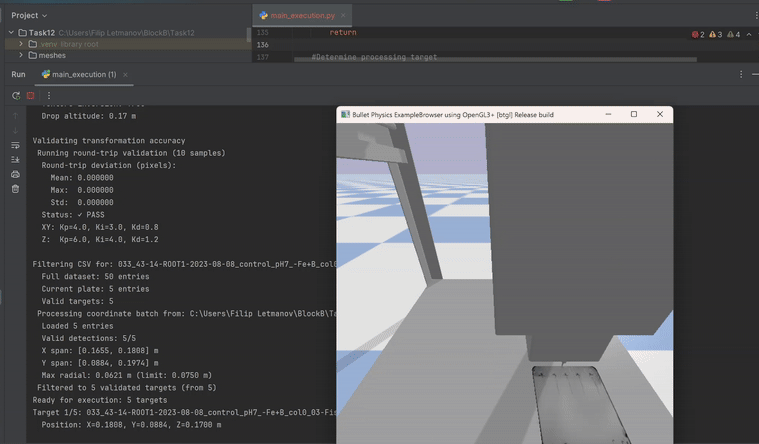
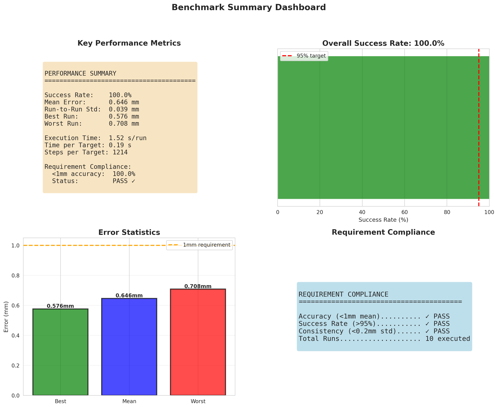

# Autonomous Root Inoculation System


[](https://github.com/filipp-lotsmanov/autonomous-root-inoculation/actions/workflows/tests.yml)



End-to-end computer vision and robotics pipeline for automated root inoculation on the Opentrons OT-2 platform. The system detects plant root tips in petri dish images using U-Net segmentation, transforms pixel coordinates to robot workspace positions, and navigates a robotic pipette to each target with sub-millimeter accuracy.

**Key Results:**
- **CV Pipeline:** 10.7% sMAPE on Kaggle private leaderboard (down from 37.6%)
- **PID Controller:** 0.011–0.031 mm steady-state positioning error
- **RL Controller:** ~99% success rate at 1mm threshold (PPO, 2M timesteps)
- **Integrated System:** 100% success rate, 0.646 mm mean positioning accuracy across 50 targets

## Contents

- [System Architecture](#system-architecture)
- [Repository Structure](#repository-structure)
- [Quick Start](#quick-start)
- [Technical Highlights](#technical-highlights)
- [Simulation Environment](#simulation-environment)

## System Architecture

```
Petri Dish Image
       │
       ▼
┌─────────────────┐
│  U-Net Semantic  │  256×256 patches, 64px overlap
│  Segmentation    │  Focal + Dice loss
└───────┬─────────┘
        │ Binary root mask
        ▼
┌─────────────────┐
│   Instance       │  Fixed spatial ROIs (domain knowledge)
│   Segmentation   │  Contour detection + spatial assignment
└───────┬─────────┘
        │ Per-plant masks
        ▼
┌─────────────────┐
│  Root Length      │  Skeletonization → geodesic distance
│  Measurement      │  BFS along skeleton graph (top → bottom)
└───────┬─────────┘
        │ Root tip coordinates (pixels)
        ▼
┌─────────────────┐
│   Spatial        │  Affine transform: pixel → robot meters
│   Transform      │  Rotation, scaling, translation
└───────┬─────────┘
        │ Target positions (meters)
        ▼
┌─────────────────┐
│  PID Motion      │  3-axis independent control
│  Controller      │  Anti-windup, derivative-on-measurement
└───────┬─────────┘
        │ Velocity commands
        ▼
   OT-2 Robot → Inoculate root tip
```

## Repository Structure

```
autonomous-root-inoculation/
├── segmentation/              # Computer vision pipeline
│   ├── config.py              # Spatial parameters and pipeline settings
│   ├── inference.py           # U-Net inference (patch extraction, stitching)
│   ├── segment_plants.py      # Instance segmentation and root analysis
│   ├── run_pipeline.py        # End-to-end pipeline: image → root lengths + tip coordinates
│   └── calibrate_plants.py    # One-time plant position calibration
│
├── controllers/
│   ├── pid/                   # PID controller (self-contained, executable)
│   │   ├── pid_controller.py    # PIDController and ThreeAxisPIDController
│   │   ├── validate_gains.py    # Step response analysis and metrics
│   │   ├── optimize_gains.py    # Grid search over Kp/Ki/Kd space
│   │   └── interactive_demo.py  # Interactive demo (requires simulation)
│   │
│   └── rl/                    # Reinforcement learning controller
│       ├── ot2_env.py         # Gymnasium wrapper, five selectable reward functions
│       ├── check_env.py       # Environment validation (SB3 env checker)
│       ├── train.py           # PPO training; --reward_type selects the reward
│       ├── evaluate.py        # 10-episode evaluation with statistics
│       └── test_wrapper.py    # Smoke test: 1000 random-action steps
│
├── integration/               # Full system integration
│   ├── main_execution.py      # Orchestration: CV → transform → navigate
│   ├── spatial_transform.py   # Pixel ↔ robot coordinate mapping
│   ├── inoculation_orchestrator.py  # State machine for inoculation workflow
│   ├── system_config.py       # All system parameters
│   ├── benchmark_system.py    # Automated benchmarking (10 runs, 50 targets)
│   └── visualize_benchmarks.py
│
├── results/                   # Pre-computed outputs and visualizations
│   ├── cv_pipeline/           # Kaggle score, U-Net predictions
│   ├── pid_performance/       # Step response and optimization plots
│   ├── integration_benchmarks/ # Benchmark dashboard and per-run results
│   └── demos/                 # System demonstration GIFs
│
├── docs/                      # Detailed technical documentation
│   ├── pipeline_evolution.md  # CV pipeline: from 37% to 10.7% sMAPE
│   ├── pid_controller.md      # PID implementation and tuning methodology
│   ├── controller_comparison.md  # PID vs RL systematic comparison
│   └── integration_benchmarks.md # Full benchmarking report
│
├── tests/                     # pytest suite (no simulator required)
│   ├── test_pid_controller.py      # Control law and tuned-gain regression
│   ├── test_spatial_transform.py   # Pixel ↔ robot round-trip and scaling
│   └── test_root_measurement.py    # Length and tip location vs known masks
│
├── .github/workflows/tests.yml # CI: pytest + PID scripts on every push
├── pyproject.toml
├── uv.lock
├── .python-version            # Pins Python 3.12 (required for model compatibility)
├── .gitignore
├── LICENSE
└── README.md
```

## Quick Start

### Prerequisites

This project requires **Python 3.12** (enforced via `.python-version`) and [uv](https://docs.astral.sh/uv/) for dependency management.

### Installation

```bash
git clone https://github.com/filipp-lotsmanov/autonomous-root-inoculation.git
cd autonomous-root-inoculation
uv sync
```

### Run the CV Pipeline

The segmentation pipeline is fully self-contained — it requires only images and the trained U-Net model.

```bash
cd segmentation
uv run python run_pipeline.py
```

This runs all three stages: U-Net inference → instance segmentation → root length and tip measurement. Output goes to `segmentation/pipeline_results/`, including `root_tips_pixels.csv` — the root tip coordinates that `integration/` consumes as its target list.

> **Note:** Place the input images in `segmentation/Kaggle/` (`.png`, `.jpg`, `.tif`). The pipeline validates this directory on startup and exits if it is empty.

> **Note:** Pre-trained weights are published under [GitHub Releases](https://github.com/filipp-lotsmanov/autonomous-root-inoculation/releases):
> - `unet_root_segmentation_256px.h5` — U-Net segmentation model, place in `segmentation/`
> - `best_model.zip` — PPO agent (`normalized_progress` reward), place in `controllers/rl/` for `evaluate.py`

### Run PID Validation (standalone)

```bash
cd controllers/pid
uv run python validate_gains.py     # Generate step response plots
uv run python optimize_gains.py     # Run grid search optimization
```

These run against a theoretical velocity model — no simulation environment needed.

### Run the tests

```bash
uv sync --extra dev
uv run pytest
```

51 tests covering the components that need no simulator: the PID control law
(anti-windup, derivative-on-measurement, output and integral clamping), the
pixel↔robot transform (round-trip consistency, affinity, scale), and root
length and tip measurement against synthetic masks with known ground truth.
Two tests pin the steady-state errors quoted in the README so a regression in
the controller shows up as a test failure. Run on every push by
[GitHub Actions](.github/workflows/tests.yml).

## Technical Highlights

### CV Pipeline

The first version of the pipeline had adaptive petri dish detection, multi-stage instance segmentation with watershed splitting, and semantic root classification. It scored 37.6% sMAPE, with most of the engineering effort going into handling fragmented roots, overlapping plants, and irregular growth patterns.

The improvement to 10.7% came from realizing that most of those components were unnecessary. The plants sit in fixed positions in every image and the petri dish doesn't move, so adaptive detection and complex merging logic were solving problems that didn't exist in this dataset. The final pipeline hardcodes plant positions, uses simple contour assignment, and measures root length via skeleton + geodesic distance.

The full writeup of what was tried and what got discarded is in [`docs/pipeline_evolution.md`](docs/pipeline_evolution.md).

### PID vs. Reinforcement Learning

Both controllers were implemented and compared for the same positioning task:

| Metric | PID | RL (PPO) |
|--------|-----|----------|
| Positioning error | 0.011–0.031 mm | < 1 mm |
| Convergence time | ~5 s | ~0.21 s |
| Deterministic | Yes | No |
| Manual tuning required | Yes | No |

PID is 30–90x more accurate but much slower to converge. RL gets there fast but with less precision. For lab automation where you're dispensing onto a root tip, the accuracy matters more — you can afford to wait 5 seconds, you can't afford to miss. PID was used for the final integration.

Full analysis in [`docs/controller_comparison.md`](docs/controller_comparison.md).

### RL Reward Function Comparison

Five reward functions were implemented and compared under identical training conditions to see how reward shaping affects learning:

| Reward Type | Final Success Rate | Observation |
|---|---|---|
| **Normalized Progress** | ~99% | Consistent gradient signal regardless of distance scale |
| Dense Shaping | ~90% | Same progress signal, unnormalized — return scale varies with spawn distance |
| Exponential (tanh) | ~90–95% | Flat gradient far from goal makes early learning slow |
| Energy Efficient | ~88% | Penalizing actions discourages the exploration you need |
| Staged Milestones | ~85% | Too little signal between the milestone thresholds |

Reward functions that provide a useful gradient at every step consistently outperformed more elaborate designs that had dead zones in their signal.

> `ot2_env.py` was revised after these runs; the dense-shaping variant benchmarked above differs from the published implementation. See [`docs/controller_comparison.md`](docs/controller_comparison.md) for the detail.

### Integration Benchmarks

The complete system was validated across 10 benchmark runs with 50 total targets:

| Metric | Result |
|--------|--------|
| Success rate | 100% (50/50) |
| Mean positioning accuracy | 0.646 mm (σ = 0.184 mm) |
| Mean time per target | 0.19 s wall-clock (≈5.06 s simulated) |
| Cross-run consistency | σ = 0.039 mm |

Two caveats on reading these numbers:

**Timing.** The 0.19 s is wall-clock with rendering disabled — it measures how fast the benchmark executes, not how fast the robot moves. In simulated time the controller takes 1214 steps at 240 Hz, or 5.06 s per target, which is the figure comparable to the ~0.21 s quoted for RL above.

**Success is thresholded at the requirement.** A target counts as successful when the pipette holds within 1 mm for 5 consecutive steps, and the accuracy statistics are computed over successful targets only. "100% success" and "all targets sub-millimetre" are therefore the same statement rather than two independent ones. No target failed to converge in these runs, so nothing was excluded — but a run where one did would drop it from the mean rather than widen it.



## Simulation Environment

The robotics components (RL training, `interactive_demo.py`, integration pipeline) require the OT-2 PyBullet simulation environment provided by Breda University of Applied Sciences. This includes `sim_class.py`, URDF model files, 3D meshes, and plate textures.

To install RL dependencies:
```bash
uv sync --extra rl
```

### RL training configuration

Training runs are submitted to a [ClearML](https://clear.ml/) server, configured separately via `clearml-init`. Deployment-specific settings are read from the environment rather than hardcoded:

| Variable | Default | Purpose |
|---|---|---|
| `CLEARML_PROJECT` | `OT2-RL` | Target project name |
| `CLEARML_QUEUE` | `default` | Execution queue |
| `CLEARML_DOCKER` | `deanis/2023y2b-rl:latest` | Base image providing the OT-2 simulation |
| `CLEARML_REPO` | unset | Optional git repository for the agent to clone |
| `CLEARML_BRANCH` | unset | Branch within `CLEARML_REPO` |
| `OT2_RUN_LABEL` | `ot2` | Prefix for run names and saved model filenames |

Note that `train.py` calls `task.execute_remotely()`, so it submits a job rather than training locally.

The reward comparison below was produced by running the same script five times, varying only `--reward_type`:

```bash
uv run python train.py \
    --reward_type normalized_progress \
    --learning_rate 0.001 \
    --total_timesteps 2000000 \
    --max_steps_truncate 250 \
    --target_threshold 0.001
```

## License

MIT — see [LICENSE](LICENSE).
