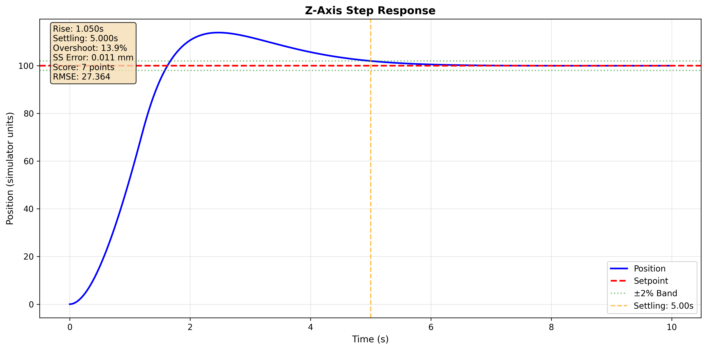
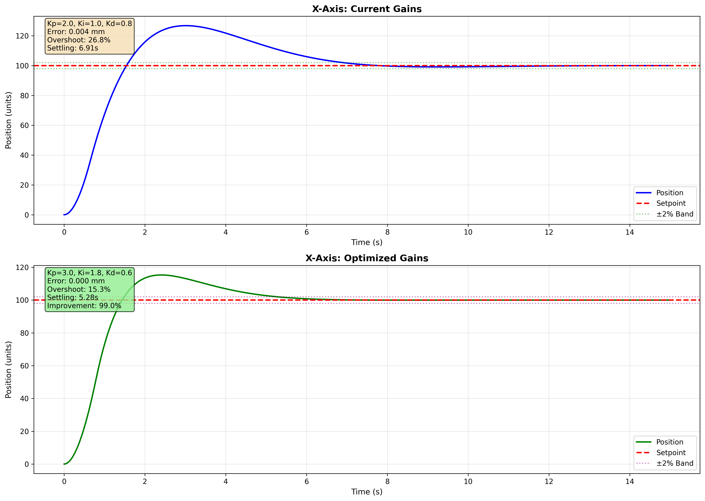
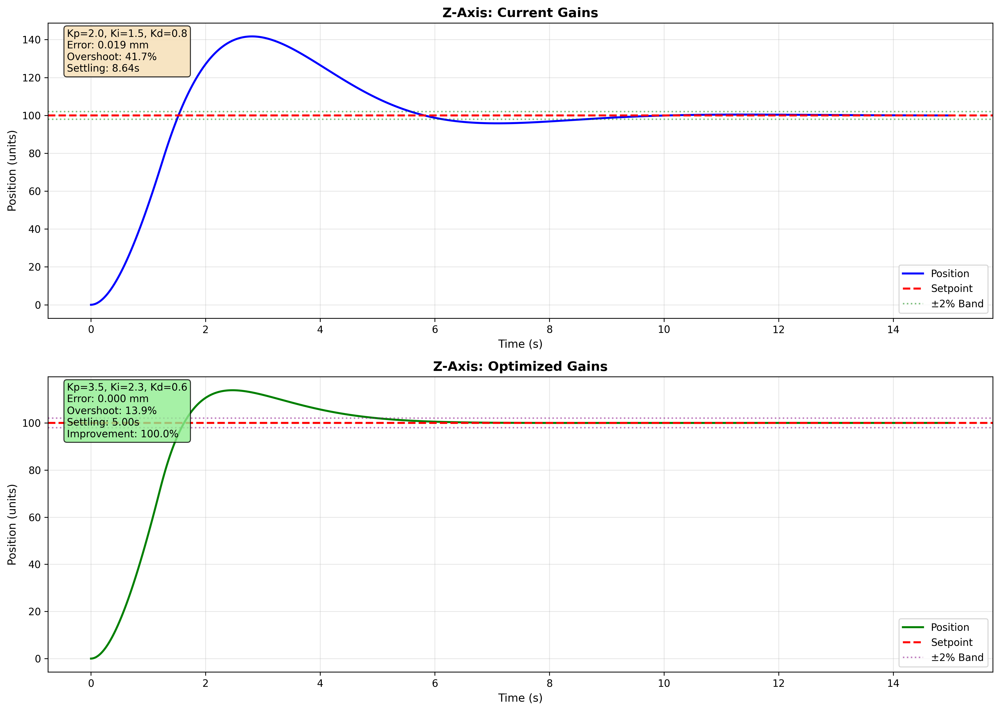

# PID Controller — OT-2 Robot

## Overview

PID (Proportional-Integral-Derivative) controller for positioning the Opentrons OT-2 robotic pipette. Achieves sub-millimeter accuracy (< 1mm positioning error) on the PyBullet simulator, tested through interactive target-reaching runs.

## Quick Start

### Prerequisites
```bash
uv sync  # from repo root
```

### Generate Results
```bash
# 1. Generate performance plots
uv run python validate_gains.py

# 2. Run gain optimization
uv run python optimize_gains.py

# 3. Run interactive robot demonstration (record for GIF)
uv run python interactive_demo.py
```

## Implementation

### Core Components

**PIDController** (`pid_controller.py`)
- Derivative-on-measurement to prevent setpoint kick
- Conditional integration for anti-windup
- Configurable output and integral limits
- Independent controllers for X, Y, Z axes

**VelocityRobotSimulator** (`validate_gains.py`)
- Theoretical first-order velocity lag model with assumed dynamics parameters
- Axis-specific dynamics (friction, velocity lag, acceleration limits)
- Used for rapid gain iteration and step response analysis before testing on the actual simulator

### Implementation details

```python
# Anti-windup: Only integrate when not saturated
if output_limits[0] < provisional_output < output_limits[1]:
    integral += error * dt

# Derivative on measurement: Avoids derivative kick
d_term = -Kd * (current_value - previous_measurement) / dt
```

## Results

### Important Note: Dual Gain Sets

This implementation uses **two different sets of gains** for different contexts:

| Purpose | X/Y Gains (Kp, Ki, Kd) | Z Gains (Kp, Ki, Kd) | Context |
|---------|-----------|---------|---------|
| **Theoretical Validation** | (3.0, 1.8, 0.6) | (3.5, 2.29, 0.6) | `validate_gains.py` - Simulated step response |
| **Actual Simulator** | (6.0, 3.6, 1.2) | (7.0, 4.6, 1.2) | `interactive_demo.py` - PyBullet robot control |

#### Why Different Gains?

The theoretical velocity simulator (`validate_gains.py`) uses a simplified first-order model with assumed dynamics parameters (friction, velocity lag, acceleration limits). These parameters approximate but do not exactly replicate the actual PyBullet simulation dynamics. As a result, gains tuned on the theoretical model needed to be roughly doubled for the actual simulator to achieve comparable performance.

Additionally, a **simulator initialization bug was discovered and announced by the course team**:

> *"It is possible to get 2 minimum Z values. This is due to the initial Z position being outside the actual working envelope."*

This required additional Z-axis safety clamping in the actual simulator code.

The theoretical model was useful for understanding PID behavior, comparing tuning strategies, and narrowing the gain search space. Final gains for the actual simulator were then tuned empirically. This dual approach mirrors real robotics engineering where simulation models serve as a starting point but hardware tuning is always required.

### Final Tuned Gains

Three gain sets appear in this repository. They are not competing answers to the same question — each was tuned against different dynamics for a different purpose. The table below is the authoritative mapping.

| Gain set | Where | Tuned against | Purpose |
|---|---|---|---|
| 3.0 / 1.8 / 0.6 (XY), 3.5 / 2.29 / 0.6 (Z) | `controllers/pid/validate_gains.py` | `VelocityRobotSimulator` (analytic friction + lag model) | Step-response characterisation and the grid search |
| 4.0 / 3.0 / 0.8 (XY), 6.0 / 4.0 / 1.2 (Z) | `integration/system_config.py` | PyBullet simulator, full pipeline | **Used for all integration benchmarks and reported results** |
| 6.0 / 3.6 / 1.2 (XY), 7.0 / 4.6 / 1.2 (Z) | `controllers/pid/interactive_demo.py` | PyBullet simulator, manual jogging | Interactive demo only; tuned for responsiveness over settling |

The analytic model and PyBullet disagree enough that gains do not transfer between them — this is why the theoretical steady-state errors (0.011–0.031 mm) are two orders of magnitude below the integrated result (0.646 mm). Only the second row backs any performance claim in the README.

**Theoretical model gains** (used in `validate_gains.py` for step response analysis):

| Axis | Kp | Ki | Kd | Steady-State Error |
|------|----|----|----|--------------------|
| **X** | 3.0 | 1.8 | 0.6 | 0.031 mm |
| **Y** | 3.0 | 1.8 | 0.6 | 0.031 mm |
| **Z** | 3.5 | 2.29 | 0.6 | 0.011 mm |

> **These figures are measured at t = 10 s.** The integrator is still converging at that point, so the steady-state error remains a strong function of the simulation window — the same gains evaluated over 15 s (as `optimize_gains.py` does) report errors roughly two orders of magnitude smaller. Quote the window alongside the number.

**Interactive demo gains** (used in `interactive_demo.py` for manual jogging in PyBullet):

| Axis | Kp | Ki | Kd | Convergence Tolerance |
|------|----|----|----|-----------------------|
| **X/Y** | 6.0 | 3.6 | 1.2 | < 1mm (10-tick hold) |
| **Z** | 7.0 | 4.6 | 1.2 | < 1mm (10-tick hold) |

### Performance Characteristics (Theoretical Model)

The following metrics are from the theoretical velocity simulator (`validate_gains.py`). They characterize PID behavior under simplified dynamics and were used to guide tuning, not as final performance claims on the actual simulator.

**X/Y Axes:**
- Rise time: 0.910s (fast initial response)
- Settling time: 5.28s (±2% band)
- Overshoot: 15.3%
- Steady-state error: 0.031 mm

**Z-Axis:**
- Rise time: 1.050s
- Settling time: 5.00s (±2% band)
- Overshoot: 13.9%
- Steady-state error: 0.011 mm
- Requires higher Kp and Ki due to 50% more friction and slower velocity lag

### Why Different Gains for Z?

The simulator models realistic axis differences:
- Z-axis friction: 1.2 (vs 0.8 for X/Y) → 50% more resistance
- Z-axis velocity lag: 0.08s (vs 0.05s for X/Y) → 60% slower response
- Z-axis max acceleration: 150 (vs 200 for X/Y) → 25% more limited

Higher Kp and Ki compensate for increased steady-state drag from friction and slower dynamics.

### Performance Validation

**Theoretical model** (`validate_gains.py`):
All three axes achieve sub-millimeter steady-state error in the simplified simulator, confirming the PID implementation and tuning methodology are sound.

**Actual PyBullet simulator** (`interactive_demo.py`):
The controller converges to within 1mm tolerance (verified by 10-tick hold at target) on interactive target-reaching tests. The GIF demonstration shows successful movement to user-specified coordinates with sub-1mm final error reported in the console output.

### Visual Results

Step response plots from the theoretical model (`validate_gains.py`):




Optimization comparison plots showing before/after gain tuning on the theoretical model (`optimize_gains.py`):




Robot movement on the actual PyBullet simulator (`interactive_demo.py`):


## Tuning Methodology

### Systematic Approach

1. **P-only tuning**: Found Kp that provides fast response without excessive oscillation
2. **Add I-term**: Increased Ki until steady-state error < 1mm
3. **Add D-term**: Adjusted Kd to balance overshoot and settling time
4. **Grid search optimization** (`optimize_gains.py`): Systematically searched Kp/Ki/Kd combinations within defined ranges, filtering by overshoot and settling time constraints, ranked by steady-state error
5. **Final selection**: Chose gains that minimize steady-state error while satisfying overshoot and settling time thresholds
6. **Simulator adaptation**: Re-tuned empirically for actual simulator dynamics (higher gains required)

### Observation

The friction and velocity lag in this simulator create trade-offs between rise time, overshoot, and steady-state accuracy. Optimization revealed that higher Kp (3.0–3.5) combined with proportionally higher Ki achieves both fast settling and near-zero steady-state error, while a lower Kd (0.6) reduces sluggishness without sacrificing stability.

## Usage

### Generate Plots

```bash
uv run python validate_gains.py
```

Saves response plots for all axes to `plots/` directory with performance metrics.

### Run Gain Optimization

```bash
uv run python optimize_gains.py
```

Performs a grid search over Kp/Ki/Kd ranges for X and Z axes, prints ranked results, and saves before/after comparison plots.

### Demonstrate Robot Movement

```bash
uv run python interactive_demo.py
```

Launches an interactive simulator interface where you can input target coordinates and observe the robot's PID-controlled movement.

### Using the Controller

```python
from pid_controller import ThreeAxisPIDController

# Initialize with tuned gains
controller = ThreeAxisPIDController(
    gains_x=(3.0, 1.8, 0.6),
    gains_y=(3.0, 1.8, 0.6),
    gains_z=(3.5, 2.29, 0.6),
    output_limits={'x': (-200, 200), 'y': (-200, 200), 'z': (-200, 200)},
    integral_limits={'x': (-100, 100), 'y': (-100, 100), 'z': (-100, 100)}
)

# Control loop
dt = 0.01
while True:
    current = get_robot_position()  # Your sensor reading
    target = (100, 50, 75)          # Desired position

    controls = controller.update(current, target, dt)
    send_to_motors(controls)        # Your actuator command
```

## Technical Notes

### Theoretical Simulator Dynamics

The velocity-based simulator in `validate_gains.py` models:
- First-order motor response: `dv/dt = (v_cmd - v) / τ`
- Viscous friction: `F_friction = -b·v`
- Acceleration limits: Physical motor constraints

The dynamics parameters (friction coefficients, velocity lag constants, acceleration limits) are assumed values chosen to approximate typical robot behavior, not derived from the actual PyBullet simulation. This model was used for rapid iteration during tuning — testing a gain set takes milliseconds in the theoretical model vs. seconds in the real simulator. Final gains for the actual simulator were tuned empirically.

### Z-Axis Safety Workaround

The actual simulator has an initialization bug where the Z-position can start outside the working envelope, creating two possible minimum Z values. To work around this:

```python
# Dynamic safety clamping in interactive_demo.py
cx, cy, cz = get_pipette_xyz(sim, robot_key)
z_min, z_max = cz - Z_MARGIN_DOWN, cz + Z_MARGIN_UP
tz = np.clip(tz, z_min, z_max)

# Envelope initialization sequence
move_pipette_to(sim, 0, (x0, y0, z0 + 0.06), verbose=False)  # Z-Max calibration
```

### Anti-Windup Strategy

Uses conditional integration: the integral term only accumulates when the controller output is not saturated. This prevents windup during large setpoint changes or physical limits.

```python
if output_limits[0] < provisional_output < output_limits[1]:
    self._integral += error * dt
    self._integral = np.clip(self._integral, integral_limits[0], integral_limits[1])
```

### Derivative on Measurement

Computing derivative from measurement change rather than error change eliminates the derivative kick that occurs when the setpoint suddenly changes. This is critical for step inputs where the error changes instantaneously.

```python
d_term = -self.Kd * (current_value - self._previous_measurement) / dt
```

## Libraries Used

- **NumPy** (v1.x): Numerical computations, array operations, and mathematical functions for PID calculations
- **Matplotlib** (v3.x): Visualization and plotting for performance analysis and step response plots
- **Time**: Timing utilities for control loop timestamping
- **Simulator Dependencies**: PyBullet-based simulation environment (provided by course infrastructure)

## Files

```
controllers/pid/
├── pid_controller.py       # Core PID implementation
│                          # - PIDController class
│                          # - ThreeAxisPIDController class
│                          # - Anti-windup and derivative-on-measurement
│
├── validate_gains.py                 # Testing framework and validation
│                          # - VelocityRobotSimulator
│                          # - Metrics calculation
│                          # - Plot generation
│
├── optimize_gains.py       # Gain optimization via grid search
│                          # - Systematic Kp/Ki/Kd sweep
│                          # - Constraint filtering (overshoot, settling time)
│                          # - Before/after comparison plots
│
└── interactive_demo.py     # Interactive robot demonstration (requires simulation)
                           # - Simulator interface with rendering
                           # - Interactive coordinate input
                           # - Real-time movement visualization
```

Pre-computed results are in `results/pid_performance/` and `results/demos/`.

## Notes

### What worked

- **Systematic tuning approach**: P→PI→PID methodology followed by automated grid search optimization
- **Theoretical simulation for rapid iteration**: Testing with velocity lag and friction dynamics enabled fast gain exploration
- **Axis-specific tuning**: Different gains for different physical characteristics
- **Anti-windup protection**: Critical for handling saturation
- **Derivative-on-measurement**: Eliminates setpoint kick
- **Two-stage tuning**: Theoretical model for rapid exploration, then empirical tuning on actual simulator

### Observations

**On Tuning Methods:**
Automated grid search (`optimize_gains.py`) proved more effective than manual tuning for finding the optimal gain combination. Starting with manual P→PI→PID gave good initial bounds for the search ranges.

**On Trade-offs:**
- Faster response (higher Kp) → More overshoot
- Stronger integral action (higher Ki) → Better accuracy but potential hunting
- More derivative action (higher Kd) → Smoother response but sluggish behavior
- Optimization showed that higher Kp+Ki with lower Kd outperformed the initial manual configuration on all metrics

**On System Dynamics:**
Velocity lag and friction create axis-specific behavior that requires independent tuning. The Z-axis consistently needed higher gains to overcome its 50% greater friction coefficient.

**On Simulation vs. Reality:**
The ~2x gain difference between the theoretical model and the actual simulator demonstrated a fundamental robotics lesson: simplified models are useful for understanding system behavior and narrowing the search space, but final tuning must happen on the actual system. The theoretical model's assumed dynamics didn't capture the full complexity of the PyBullet simulation, making empirical re-tuning essential.

## Performance Summary

### Theoretical Model Metrics (`validate_gains.py`)

| Metric | X-Axis | Y-Axis | Z-Axis |
|--------|--------|--------|--------|
| **SS Error** | 0.031 mm | 0.031 mm | 0.011 mm |
| **Rise Time** | 0.910 s | 0.910 s | 1.050 s |
| **Settling Time** | 5.28 s | 5.28 s | 5.00 s |
| **Overshoot** | 15.3% | 15.3% | 13.9% |

### Actual Simulator (`interactive_demo.py`)

| Metric | X/Y Axes | Z Axis |
|--------|----------|--------|
| **Convergence tolerance** | < 1mm | < 1mm |
| **Hold requirement** | 10 consecutive ticks | 10 consecutive ticks |
| **Timeout** | 15s | 15s |

---

The controller hits sub-millimeter positioning on both the theoretical model and the actual PyBullet simulator. Getting there required a combination of automated grid search on the theoretical model and then re-tuning empirically on the real sim — the theoretical gains needed roughly doubling to work on the actual dynamics.